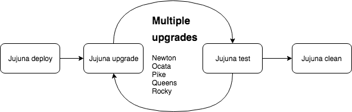

Use cases
=================

Jujuna provides four main functions that allow us to assemble various
pipelines and test multiple scenarios: deploy, upgrade, test, and cleanup.
These functions allow us to properly test software upgrades, from simple
tests up to multistage upgrades.

We use Jujuna for three main purposes at `HUNT Cloud
<https://www.ntnu.edu/huntgenes/hunt-cloud>`_, all to test desired
deployments and service upgrades of OpenStack. We utilize a dedicated stack of
test hardware, with very similar configuration to our production site. We
deploy the OpenStack Juju bundle with all the applications that we have in
production, although at a smaller scale.

Case 1: Continuous integration
------------------------------

Test of configuration changed as a part of bundle repository CI. Everytime the
Juju bundle is changed it is automatically deployed and tested. All the results
are pushed back to our CI. Passing result from pipeline approves the change.

Case 2: Revision upgrades
-------------------------

New charm revisions are released more often than the services. Release time
also depends on channels that charm developers use. You can regularly run
Jujuna to test new or nightly releases from edge channel of charm revisions.

Case 3: Service upgrades
------------------------

Test before upgrade. Whenever there is need to upgrade production services,
you can easily deploy your test stack, upgrade required services, and run
your testing suite. We find both upgrade processes and testing useful to
identify potential issues.
